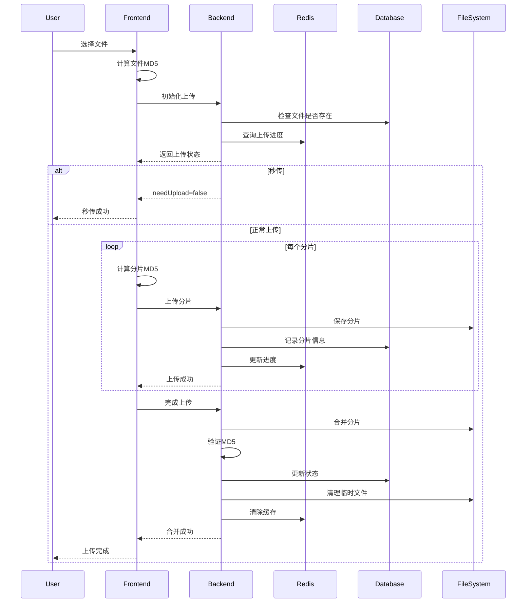

# 文件上传模块开发总览

## 📁 项目结构

### 后端文件（Spring Boot）

```
src/main/java/com/yupi/yuaiagent/
├── controller/
│   └── FileUploadController.java          # 文件上传控制器
├── service/
│   ├── IFileUploadService.java            # 服务接口
│   └── impl/
│       └── FileUploadService.java         # 服务实现
├── mapper/
│   ├── FileUploadMapper.java              # 文件上传Mapper
│   └── ChunkInfoMapper.java               # 分片信息Mapper
├── domin/
│   ├── entity/
│   │   ├── FileUpload.java                # 文件上传实体
│   │   └── ChunkInfo.java                 # 分片信息实体
│   └── dto/
│       ├── InitiateUploadRequest.java     # 初始化请求
│       ├── InitiateUploadResponse.java    # 初始化响应
│       ├── UploadChunkRequest.java        # 上传分片请求
│       ├── UploadStatusResponse.java      # 状态查询响应
│       └── CompleteUploadRequest.java     # 完成上传请求
└── util/
    └── FileUtils.java                      # 文件工具类

src/main/resources/
├── mapper/
│   ├── FileUploadMapper.xml               # 文件上传SQL映射
│   └── ChunkInfoMapper.xml                # 分片信息SQL映射
└── application.yml                         # 配置文件（已更新）
```

### 前端文件（Vue 3）

```
src/
├── api/
│   └── fileUploadApi.js                   # 文件上传API封装
├── utils/
│   └── md5.js                             # MD5计算工具
├── components/
│   └── FileUploader.vue                   # 文件上传组件
├── views/
│   └── FileUpload.vue                     # 文件上传页面
└── router/
    └── index.js                            # 路由配置（已更新）
```

## 🎯 功能实现清单

### ✅ 后端功能

- [x] 文件上传记录管理
- [x] 分片信息管理
- [x] MD5 秒传检测
- [x] 断点续传支持
- [x] 分片上传处理
- [x] 文件合并功能
- [x] 文件类型验证（.docx, .md, .pdf）
- [x] Redis 缓存上传进度
- [x] 数据库持久化
- [x] 用户身份关联
- [x] 临时文件清理

### ✅ 前端功能

- [x] 文件选择
- [x] MD5 计算（支持 spark-md5 和原生 API）
- [x] 文件分片（2MB）
- [x] 分片上传
- [x] 上传进度显示
- [x] 上传速度计算
- [x] 剩余时间预估
- [x] 断点续传
- [x] 秒传检测
- [x] 错误重试（最多 3 次）
- [x] 取消上传
- [x] 文件类型验证
- [x] 响应式 UI

## 📊 数据库表结构

### file_upload 表

```sql
CREATE TABLE file_upload (
    id BIGSERIAL PRIMARY KEY,
    file_md5 VARCHAR(32) NOT NULL,
    file_name VARCHAR(255) NOT NULL,
    total_size BIGINT NOT NULL,
    status SMALLINT NOT NULL DEFAULT 0,
    user_id VARCHAR(64) NOT NULL,
    org_tag VARCHAR(50),
    is_public BOOLEAN NOT NULL DEFAULT FALSE,
    created_at TIMESTAMP WITHOUT TIME ZONE NOT NULL DEFAULT CURRENT_TIMESTAMP,
    merged_at TIMESTAMP WITHOUT TIME ZONE
);
```

### chunk_info 表

```sql
CREATE TABLE chunk_info (
    id BIGSERIAL PRIMARY KEY,
    file_md5 VARCHAR(32) NOT NULL,
    chunk_index INT NOT NULL,
    chunk_md5 VARCHAR(32) NOT NULL,
    storage_path VARCHAR(255) NOT NULL
);
```

## 🔄 上传流程



## 🚀 部署说明

### 环境要求

**后端：**

- JDK 17+
- Spring Boot 3.x
- PostgreSQL 12+
- Redis 7.0+
- Maven 3.6+

**前端：**

- Node.js 16+
- Vue 3.2+
- Vite 4.x

### 启动步骤

**1. 启动后端**

```bash
cd yu-ai-agent-master
./mvnw spring-boot:run
```

**2. 启动前端**

```bash
cd yu-ai-agent-frontend
npm install
npm install spark-md5  # 可选，推荐
npm run dev
```

**3. 访问页面**

```
http://localhost:5173/file-upload
```

## 📝 配置说明

### 后端配置（application.yml）

```yaml
# MyBatis Mapper 配置
mybatis:
  mapper-locations: classpath:mapper/MiningAgentUserMapper.xml,classpath:mapper/MiningAgentConversationMapper.xml,classpath:mapper/FileUploadMapper.xml,classpath:mapper/ChunkInfoMapper.xml

# 文件上传配置
file:
  upload:
    chunk-size: 2097152 # 2MB 分片
    temp-dir: ./upload/temp # 临时目录
    final-dir: ./upload/files # 最终目录
```

### 前端配置

```javascript
// fileUploadApi.js
const API_BASE_URL =
  process.env.NODE_ENV === 'production' ? '/api' : 'http://localhost:8123/api'

// FileUploader.vue
const CHUNK_SIZE = 2 * 1024 * 1024 // 2MB
const MAX_RETRY = 3 // 最大重试次数
```

## 🔧 自定义扩展

### 修改支持的文件类型

**后端：**

```java
// FileUtils.java
public static boolean isAllowedFileType(String fileName) {
    String lowerCaseName = fileName.toLowerCase();
    return lowerCaseName.endsWith(".docx")
        || lowerCaseName.endsWith(".md")
        || lowerCaseName.endsWith(".pdf")
        || lowerCaseName.endsWith(".txt")  // 新增
        || lowerCaseName.endsWith(".xlsx"); // 新增
}
```

**前端：**

```javascript
// FileUploader.vue
const allowedTypes = ['.docx', '.md', '.pdf', '.txt', '.xlsx']
```

### 修改分片大小

**后端：**

```yaml
file:
  upload:
    chunk-size: 5242880 # 改为 5MB
```

**前端：**

```javascript
const CHUNK_SIZE = 5 * 1024 * 1024 // 改为 5MB
```

### 添加文件数量限制

```javascript
// FileUploader.vue
const MAX_FILE_SIZE = 100 * 1024 * 1024 // 100MB

const handleFileSelect = async (event) => {
  const file = event.target.files[0]
  if (file.size > MAX_FILE_SIZE) {
    errorMessage.value = '文件大小不能超过 100MB'
    return
  }
  // ... 其他逻辑
}
```

## 🐛 常见问题

### Q1: 上传失败，提示 "初始化失败"

**A:** 检查后端服务是否启动，数据库连接是否正常。

### Q2: MD5 计算很慢

**A:** 安装 `npm install spark-md5` 可以显著提升速度。

### Q3: 分片上传失败

**A:** 检查网络连接，查看后端日志，确认临时目录有写权限。

### Q4: 文件合并失败

**A:** 检查所有分片是否上传完成，查看后端磁盘空间是否足够。

### Q5: 断点续传不生效

**A:** 检查 Redis 服务是否正常，确认文件 MD5 一致。

## 📚 技术要点

### 1. 分片上传原理

```javascript
// 使用 Blob.slice() 分割文件
const start = chunkIndex * CHUNK_SIZE
const end = Math.min(start + CHUNK_SIZE, file.size)
const chunk = file.slice(start, end)
```

### 2. MD5 计算

```javascript
// 使用 spark-md5 增量计算
const spark = new SparkMD5.ArrayBuffer()
spark.append(arrayBuffer)
const md5 = spark.end()
```

### 3. 断点续传

```javascript
// 查询已上传分片
const response = await getUploadStatus(fileMd5, userId)
const uploadedChunks = response.data.uploadedChunks

// 跳过已上传分片
if (uploadedChunks.includes(chunkIndex)) {
  continue
}
```

### 4. 秒传检测

```java
// 检查文件是否已存在
FileUpload existingFile = fileUploadMapper.selectByFileMd5(fileMd5);
if (existingFile != null && existingFile.getStatus() == 1) {
    return new Response(false, "文件已存在，秒传成功");
}
```

### 5. 文件合并

```java
// 按顺序合并分片
chunkFiles.sort(Comparator.comparing(File::getName));
try (FileOutputStream fos = new FileOutputStream(targetFile)) {
    for (File chunkFile : chunkFiles) {
        Files.copy(chunkFile.toPath(), fos);
    }
}
```

## 🎨 UI 截图说明

1. **初始状态** - 显示"选择文件"按钮
2. **文件选中** - 显示文件信息、进度条、操作按钮
3. **上传中** - 进度条动态更新、显示速度和剩余时间
4. **上传完成** - 绿色成功提示
5. **上传失败** - 红色错误提示
6. **断点续传** - 显示已上传分片数量和"断点续传"按钮

## 📈 性能优化建议

1. **并发上传** - 同时上传多个分片（需修改后端支持）
2. **WebWorker** - 在 Worker 中计算 MD5，避免阻塞 UI
3. **压缩传输** - 对可压缩文件启用 gzip
4. **CDN 加速** - 大文件可上传到 CDN
5. **分片去重** - 多个文件的相同分片只存储一次

## 🔐 安全建议

1. **文件类型检查** - 服务端验证文件真实类型（MIME）
2. **文件大小限制** - 防止恶意上传超大文件
3. **访问控制** - 基于用户权限控制上传
4. **病毒扫描** - 集成病毒扫描服务
5. **签名验证** - 使用签名防止篡改

## 📞 技术支持

如有问题，请：

1. 查看控制台日志
2. 检查网络请求
3. 查看后端日志
4. 提交 Issue

---

**开发完成日期：** 2025-12-12  
**版本：** v1.0.0  
**开发者：** AI Assistant  
**技术栈：** Spring Boot 3 + Vue 3 + PostgreSQL + Redis
